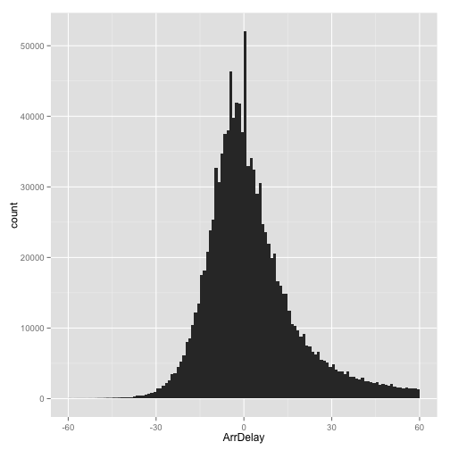
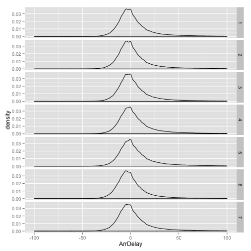
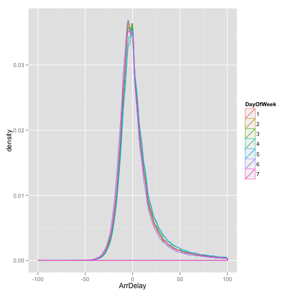
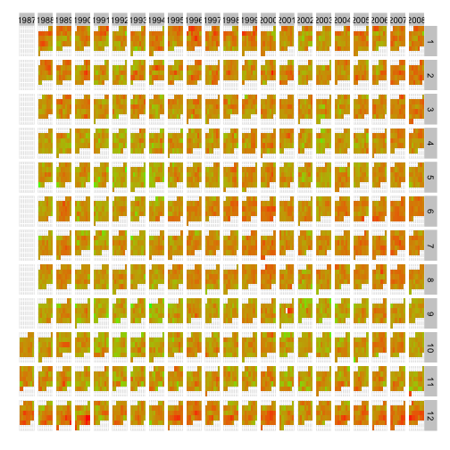

Basics ggplot2, dplyr and data.table
========================================================
author: Benilton Carvalho
date: November 2014
width: 1440
height: 900

Loading useful packages
========================================================

- The `ggplot2` package is one of the best packages for the production of high-quality plots.
- `ggplot2` requires the data to be in a specific format, for which I use the `dplyr` package.
- Given that these data can get very large, I also use the `data.table` package to improve data access and management.


```r
library(ggplot2)
library(dplyr)
library(data.table)
```

Reading the data
========================================================

- Reading CSV file
- Converting the resulting data.frame into a data.table for faster manipulation


```r
fname = '~/Downloads/data/AirlineSubset1pct.csv'
airline = read.csv(fname, header=TRUE)
airline = data.table(airline)
airline[, 1:7, with=FALSE]
```

```
         Year Month DayofMonth DayOfWeek DepTime CRSDepTime ArrTime
      1: 1987    10         17         6     741        730     918
      2: 1987    10         27         2     916        915    1014
      3: 1987    10         29         4     745        745     804
      4: 1987    10         27         2     645        645     800
      5: 1987    10         26         1    1028       1029    1140
     ---                                                           
1235019: 2008    12         13         6    1433       1435    1613
1235020: 2008    12         13         6     929        930    1117
1235021: 2008    12         13         6    1851       1849    2009
1235022: 2008    12         13         6    1136       1056    1427
1235023: 2008    12         13         6    1422       1355    2007
```


Operating with a `data.table` object
========================================================

- A `data.table` object is pretty much a `data.frame`


```r
summary(airline[,1:7, with=FALSE])
```

```
      Year          Month          DayofMonth      DayOfWeek    
 Min.   :1987   Min.   : 1.000   Min.   : 1.00   Min.   :1.000  
 1st Qu.:1993   1st Qu.: 4.000   1st Qu.: 8.00   1st Qu.:2.000  
 Median :1999   Median : 7.000   Median :16.00   Median :4.000  
 Mean   :1999   Mean   : 6.548   Mean   :15.73   Mean   :3.941  
 3rd Qu.:2004   3rd Qu.:10.000   3rd Qu.:23.00   3rd Qu.:6.000  
 Max.   :2008   Max.   :12.000   Max.   :31.00   Max.   :7.000  
                                                                
    DepTime        CRSDepTime      ArrTime     
 Min.   :   1    Min.   :   0   Min.   :   1   
 1st Qu.: 934    1st Qu.: 930   1st Qu.:1116   
 Median :1334    Median :1328   Median :1522   
 Mean   :1349    Mean   :1335   Mean   :1494   
 3rd Qu.:1738    3rd Qu.:1729   3rd Qu.:1917   
 Max.   :2533    Max.   :2400   Max.   :2701   
 NA's   :22874                  NA's   :25659  
```

Customizing data representation
=========================================================

- Will convert Year/Month/DayOfWeek/DayofMonth to ordered factors


```r
dim(airline)
```

```
[1] 1235023      29
```

```r
airline$Year = factor(airline$Year, ordered=TRUE)
airline$Month = factor(airline$Month, ordered=TRUE)
airline$DayOfWeek = factor(airline$DayOfWeek, ordered=TRUE)
airline$DayofMonth = factor(airline$DayofMonth, ordered=TRUE)
```

Cleaning dataset
=================

- Keep only flights that were not cancelled


```r
airline = subset(airline, Cancelled==0)
dim(airline)
```

```
[1] 1212142      29
```

Making histograms
========================================================

- `ggplot2` requires data in the long-format
- always use `ggplot` to start and combine `aes()` to define plot details (x, y, color)
- always use a `geom_` to define plot type


```r
myp = ggplot(airline, aes(ArrDelay)) + geom_histogram(binwidth=1)
myp + xlim(-60, 60)
```

 

Making stratified density plots - I
========================================================


```r
myp = ggplot(airline, aes(ArrDelay)) + geom_density() 
myp + facet_grid(DayOfWeek ~ . ) + xlim(-100, 100)
```

 


Making stratified density plots - II
========================================================


```r
myp = ggplot(airline, aes(ArrDelay, colour=DayOfWeek))
myp + geom_density() + xlim(-100, 100)
```

 

Operating with `dplyr` for plotting
========================================================

- Proportion of flights delayed (by more than 15min) per date


```r
tmp = group_by(airline, Year, Month, DayofMonth)
delays = summarise(tmp, prop=mean(ArrDelay > 15, na.rm=TRUE))
delays
```

```
Source: local data table [7,762 x 4]
Groups: Year, Month

   Year Month DayofMonth      prop
1  1987    10          1 0.2170543
2  1987    10          2 0.1986755
3  1987    10          3 0.1833333
4  1987    10          4 0.1200000
5  1987    10          5 0.1265823
6  1987    10          6 0.1632653
7  1987    10          7 0.1891892
8  1987    10          8 0.1914894
9  1987    10          9 0.1242604
10 1987    10         10 0.1428571
..  ...   ...        ...       ...
```

Helper function
========================================================

- Function to return row/column for dates as in a calendar


```r
library(lubridate)
cal = function(dt){
  year = year(dt)
  month = month(dt)
  day = day(dt)
  first = ymd(paste(year, month, 1, sep='-'))
  wday_first = wday(first)
  offset = 5 + wday_first
  weekrow = ((day + offset) %/% 7) - 1
  daycol = (day + offset) %% 7
  cbind(weekrow, daycol)
}
```

Calendar with delays
===============


```r
tmp = cal( with(delays, paste(Year, Month, DayofMonth, sep='-')))
delays$weekrow = factor(tmp[,1], levels=5:0, ordered=TRUE)
delays$daycol = factor(tmp[,2], levels=0:6, ordered=TRUE)
logit = function(p) log(p/(1-p))
head(delays)
```

```
  Year Month DayofMonth      prop weekrow daycol
1 1987    10          1 0.2170543       0      4
2 1987    10          2 0.1986755       0      5
3 1987    10          3 0.1833333       0      6
4 1987    10          4 0.1200000       1      0
5 1987    10          5 0.1265823       1      1
6 1987    10          6 0.1632653       1      2
```

Preparing the final plot
===


```r
myp = ggplot(delays, aes(daycol, weekrow, fill=logit(prop)))
myp = myp + geom_tile() + facet_grid(Month ~ Year)
myp = myp + scale_fill_continuous(low='green', high='red')
myp = myp + theme(axis.ticks=element_blank(),
                  axis.title.x=element_blank(),
                  axis.title.y=element_blank(),
                  axis.text.x=element_blank(),
                  axis.text.y=element_blank(),
                  legend.position='none')
```

The final plot
===


